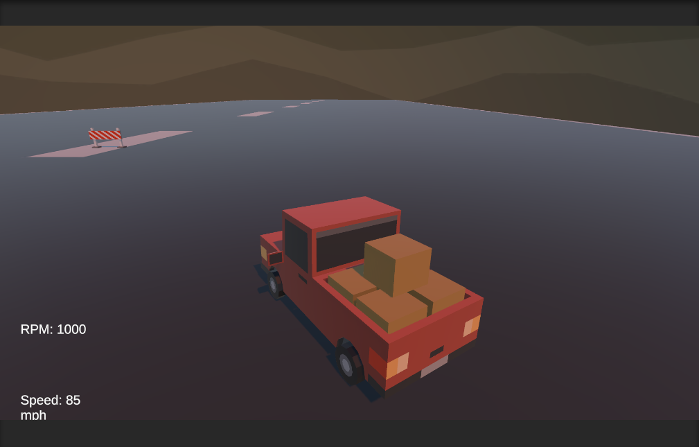

# Car Driving  Prototype

## Overview

Car Driving Prototype is a simple prototype simulating the basic driving experience. Players control a car using WASD controls and can see the BPM (revolutions per minute) and KM/h (kilometers per hour) values displayed at the top of the screen.

## Core Features

### Car Controls
- W: Accelerate
- A: Turn Left
- S: Reverse
- D: Turn Right
### Car Driving Prototype On-Screen Indicators

- BPM (revolutions per minute): Indicates the engine's RPM.
- KM/h (kilometers per hour): Displays the car's speed in kilometers.

## How to Play

1. Start driving by using the WASD keys as the game begins.
2. Monitor the BPM and KM/h values at the top of the screen to track the car's performance.
3. Practice to enhance your basic driving skills.

## Screenshots

